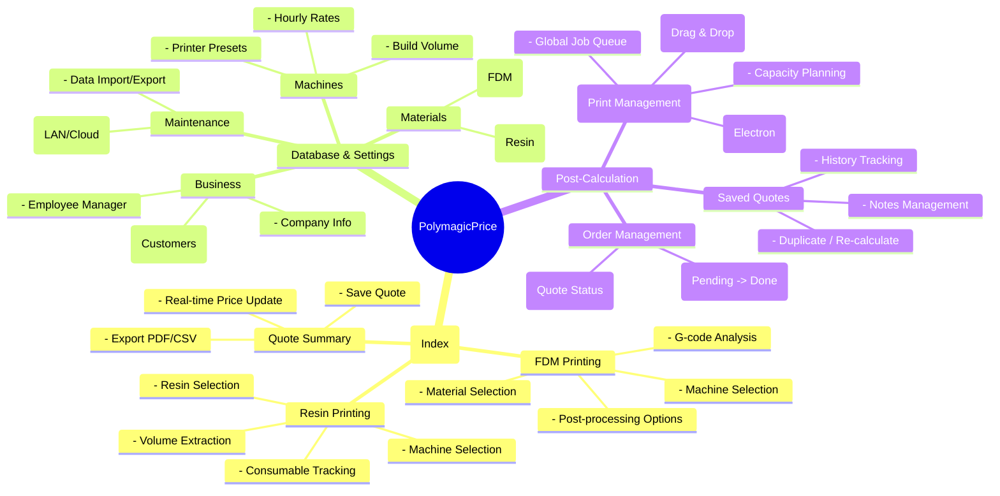
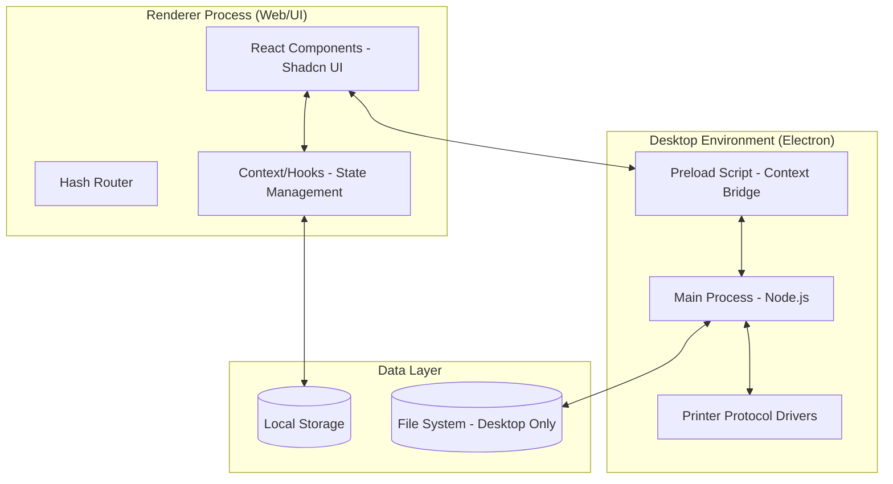
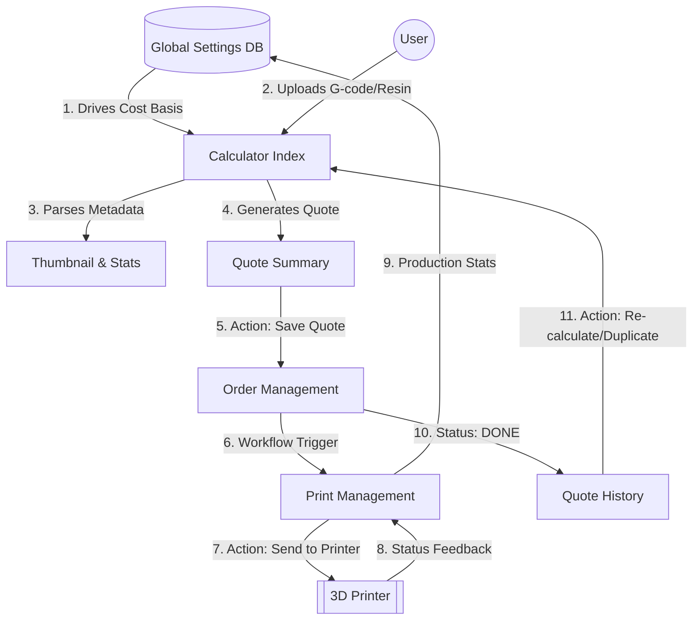

# PolymagicPrice Master Logic & Architecture Mindmap

This document serves as the unified source of truth for the PolymagicPrice application, detailing its features, system architecture, technical stack, and logical interdependencies.

---

## 1. Application Structure (Mindmap)

---

## 2. System Architecture & Flow

### A. High-Level Architecture (Electron/React)
PolymagicPrice is a cross-platform application using the **Electron** framework for desktop and **Vite/React** for the frontend.

### B. Closed-Loop Logic Flow
The application operates as a feedback loop where settings drive calculations, and production outcomes validate future pricing strategies.

---

## 3. Technical Stack Breakdown

| Category | Technology | Usage in Project |
| :--- | :--- | :--- |
| **Languages** | TypeScript | Type-safe logic for both Frontend and Electron Main process. |
| **Frontend** | [React 18](https://react.dev/) | Component-based UI using Vite as the build tool. |
| **Styling** | Tailwind CSS + Shadcn UI | Modern, responsive design system. |
| **State** | TanStack Query | Manages async server state and browser-based data syncing. |
| **Desktop** | [Electron](https://www.electronjs.org/) | Bridges the web app with physical printer hardware. |
| **Database** | Local Storage | All user data persists locally without a central server. |
| **Protocols** | MQTT + FTP | Used for low-latency communication with 3D printers. |

---

## 4. Key Feature & Button Logic

| Feature/Button | Source | Logical Action (The "Closed Loop") |
| :--- | :--- | :--- |
| **G-code Analysis** | `Index.tsx` | Parses file metadata -> Updates Weight -> Triggers Price Refresh in real-time. |
| **Save Quote** | `QuoteSummary` | Validates calculation -> Persists to DB -> Automatically appears in Kanban board. |
| **Drag & Drop Job** | `PrintManagement` | Assigns job to machine -> Re-calculates total remaining time via Capacity Planner. |
| **Duplicate/Re-calculate**| `SavedQuotes` | Fetches historical price/material -> Feeds parameters BACK into the main calculator. |
| **Material Update** | `Settings.tsx` | Updating a price cascades through all "Draft" calculations immediately. |

---

## 5. Core Responsibilities

- **Renderer Process (Frontend)**: Handles all UI/UX, cost calculations (`/src/lib/quoteCalculations.ts`), and slicer file parsing.
- **Main Process (Backend)**: Handles OS-level tasks like writing to the file system, opening network sockets for printer communication, and window management.

---
*Generated by Antigravity*
